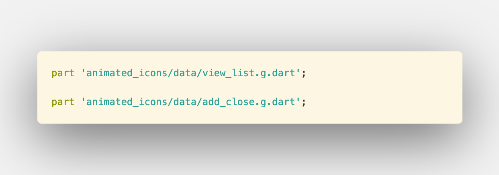

1. build your `AnimatedIconData` file,copy in path:   
    `[your path]/flutter/packages/flutter/lib/src/material/animated_icons/data`  
2. I make a examle  `add_close.g.dart` file,  you can use it.
3. add line `static const AnimatedIconData add_close = _$add_close;` to file `animated_icons_data.dart`
  
4. add line `part 'animated_icons/data/add_close.g.dart';` to file `animated_icons.dart`


5. use it 
```dart
import 'package:flutter/material.dart';

void main() {
  runApp(MyApp());
}

class MyApp extends StatelessWidget {
  @override
  Widget build(BuildContext context) {
    return MaterialApp(
      title: 'Flutter Demo',
      home: MyHomePage(title: 'Custom AnimatedIcon Demo'),
    );
  }
}

class MyHomePage extends StatefulWidget {
  MyHomePage({Key key, this.title}) : super(key: key);

  final String title;

  @override
  _MyHomePageState createState() => _MyHomePageState();
}

class _MyHomePageState extends State<MyHomePage>
    with SingleTickerProviderStateMixin {
  AnimationController _animationController;
  bool _isOpen = false;

  @override
  void initState() {
    super.initState();
    _animationController =
        AnimationController(vsync: this, duration: Duration(milliseconds: 300));
  }

  @override
  Widget build(BuildContext context) {
    return Scaffold(
      appBar: AppBar(
        title: Text(widget.title),
      ),
      body: Center(
        child: IconButton(
          iconSize: 46.0,
          color: Colors.orange,
          icon: AnimatedIcon(
              icon: AnimatedIcons.add_close, progress: _animationController),
          onPressed: () {
            _isOpen = !_isOpen;
            _isOpen
                ? _animationController.forward()
                : _animationController.reverse();
          },
        ),
      ),
    );
  }
}
```

